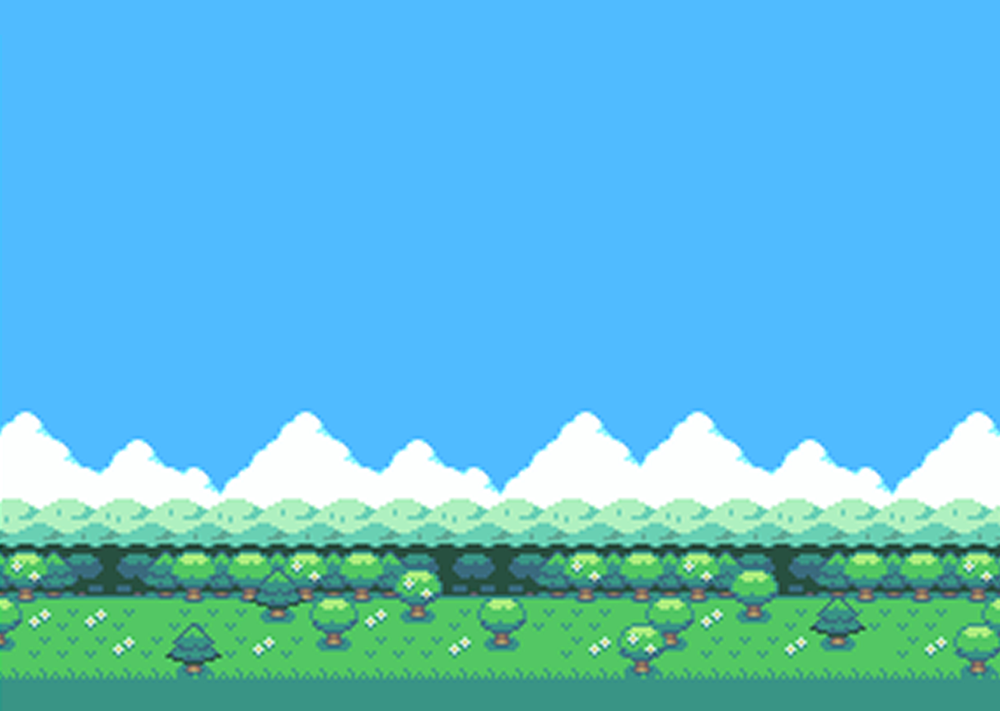

# 🌟 Mojitown

<div align="center">
  
  <br/>
  <em>"Tiny friends, big emotions."</em>
</div>

## 📱 About Mojitown

**Mojitown** is an emotionally intelligent AI village where users create customizable characters ("Mojis") with unique personalities. These Mojis live, interact, and grow in a cozy virtual world, offering emotional support through playful, therapeutic conversations and rich social simulation.

<div align="center">
  
  
</div>

## 📌 Project Scope

This project explores how emotionally aware AI companions can support wellness and everyday reflection in a calming, character-driven environment.

### Stage 1 Focus (April–June 2025)

- Creating custom characters with distinct personalities and roles
- Building a visual simulation where Mojis interact with one another
- Allowing users to engage in AI conversations with Mojis based on their traits

## 👨‍👩‍👧‍👦 Target Users

- **Young adults (18–35)** looking for emotional support in a low-pressure environment
- **Neurodiverse individuals** who benefit from consistent and calming digital routines
- **Cozy game lovers** and creatives who enjoy customizable character-based experiences
- **Users seeking** light, emotionally intelligent AI companions for daily interaction

## ✨ Features

### ✅ Stage 1 (Due by June 6, 2025)

#### Character Creation
- Define personality traits (e.g., MBTI)
- Assign professions and backstories
- Customize appearance via emoji selection
- **✅ Complete:** Choose character color, birthday, and zodiac sign
- **✅ Complete:** Persistent character data across sessions with Zustand + localStorage
- **✅ Complete:** Create and manage multiple Moji characters in your village
- **✅ Complete:** Enhanced emoji selection with 10 different character types
- **✅ Complete:** Real-time character preview with color customization
- **✅ Complete:** Automatic zodiac sign calculation from birthday

#### AI Conversations
- Personality-driven dialogue
- Responsive to topic-based user prompts
- Emotionally supportive interactions

#### Village Simulation
- **✅ Complete: Advanced Moji Interactions & Movement:**
    - ✅ Mojis have sophisticated animated entry sequences (dropping, posing, then walking)
    - ✅ Each Moji walks independently with randomized initial direction (left/right)
    - ✅ Smart vertical track system - Mojis select one of four distinct grass-level tracks
    - ✅ Characters walk completely off-screen before turning around and re-entering on new tracks
    - ✅ Refined walking speeds and animation timing for natural movement
    - ✅ "Add Another Moji" button for easy village population expansion

- **✅ Complete: Dynamic Conversation System:**
    - ✅ Face-to-face encounter detection between walking Mojis
    - ✅ Automatic conversation triggering when Mojis meet on the same track
    - ✅ Speech bubble system with "Hello!" and "Hi!" exchanges
    - ✅ Conversation state management preventing walking during interactions
    - ✅ Cooldown system preventing immediate re-conversations between same characters
    - ✅ Position tracking and collision detection for natural social behaviors

- **✅ Complete: Enhanced Character Animation:**
    - ✅ Multi-frame sprite animation with proper directional handling
    - ✅ Greeting animations for existing characters on page refresh
    - ✅ Smooth walking cycles with frame-by-frame animation
    - ✅ Character state persistence (conversation status, positions, directions)

- **✅ Complete: UI & Visual Improvements:**
    - ✅ Pixel-perfect UI components with retro styling
    - ✅ Ground/grass rendering system
    - ✅ Character preview system during creation
    - ✅ Responsive background and layout design

### 🔮 Future Implementation (Post-June 6, 2025)

#### Learning Companion Mode
- Choose a Moji to follow your reading
- Moji learns from the content you read
- Provides summaries, answers questions, and reinforces learning

#### Advanced Social Features
- Multi-user village sharing
- Character development over time
- Seasonal events and celebrations
- Extended conversation topics and personality-driven responses

## 🧰 Tech Stack

- **Frontend**: React.js, Tailwind CSS
- **State Management**: Zustand with localStorage persistence
- **Character AI**: Custom AI models for personality-driven dialogue
- **Animation**: CSS transitions and requestAnimationFrame for smooth character movement
- **Sprites**: Pixel art character animations with multi-frame support
- **Deployment**: [Platform to be determined]

## 🗓️ Timeline (Stage 1 – Until June 6, 2025)

| Phase | Description | Status | Timeframe |
|-------|-------------|---------|-----------|
| 🔧 Feature Planning & Mindmap | Define features, prioritize scope | ✅ Complete | April Week 2 |
| 🧠 AI + UI Prototype | Build character creation + interaction | ✅ Complete | April Week 3–4 |
| 🏘️ Village Simulation | Characters interacting in a shared world | ✅ Complete | May Week 1–3 |
| 🧪 Testing & Polish | Test flows, refine UI, finalize logic | 🔄 In Progress | May Week 4 – June Week 1 |
| 🚀 Final Delivery | Submit and demo Stage 1 | ⏳ Pending | **June 6, 2025** |

## 🚀 Getting Started

### Prerequisites
- Node.js (v18+)
- npm or yarn

### Installation
1. Clone the repository
   ```bash
   git clone https://github.com/xanx66/mojitown.git
   cd mojitown
   ```

2. Navigate to the client directory and install dependencies
   ```bash
   cd client
   npm install
   # or
   yarn install
   ```

3. Start the development server
   ```bash
   npm run dev
   # or
   yarn dev
   ```

4. Open your browser and navigate to `http://localhost:5173`

## 🧑‍🤝‍🧑 Team Contact

- **Fiona Wu** — itzsyboo@uw.edu
- **Annika An** — xanx5@uw.edu

---

<div align="center">
  <p>University of Washington Project • 2025</p>
  <p>Made with 💙 by Team Mojitown</p>
</div>